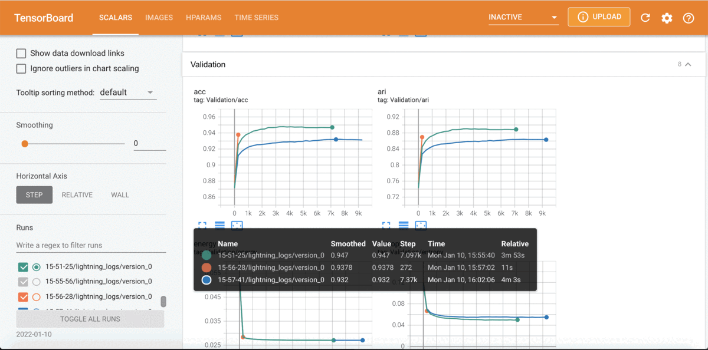

# MixMate

The Mixture Model Auto-Encoders (MixMate) is a neural network architecture for 
clustering data that is derived from a generative model based on dictionary learning.
Further details can be found in our preprint [here](https://arxiv.org/abs/2110.04683).

## Executing Code
This codebase contains the implementation of the model, supporting parallel computation and batch training.  To run the code, execute the following commands:
```bash
git clone https://github.com/al5250/mixmate
cd mixmate
pip install -r requirements.txt
python trainv2.py
```

## Viewing Results
All results will be logged in your `outputs` folder (if it does not exist, it will be created after running `python trainv2.py` the first time).  Runs are logged according to the clocktime that they are executed.  For example, to see a run executed on January 2nd, 2022 at 1:11 PM, execute
```bash
cd outputs
cd 2022-02-01
tensorboard --logdir .
```
The run will be stored as `13-01-11/lightning_logs/version_0`.  Through [TensorBoard](https://www.tensorflow.org/tensorboard), our code logs many metrics, images (e.g. dictionary columns that are learned), and hyperparameters associated with each run.



## Changing Experimental Settings
To play around with different experimental settings (e.g. datasets, hyperparameters) check out the `configs/trainv2.yaml` file.  Our codebase is powered by [Hydra](https://hydra.cc/).  Editing this one config file is sufficient for reproducing all experiments in our paper.  After saving the changes, simply execute `python trainv2.py` to see the new results in your `outputs` folder.

- **Running default config file**: This reproduces the MNIST clustering experiments in Table 1 of our paper.  You can run it multiple times to see results from multiple runs.
- **FashionMNIST and USPS results**: Simply change the `dataset.name` attribute in the config file to reproduce the results in Table 1 for these datasets.  USPS will also require setting `mixmate.input_size: 30` and `mixmate.sparse_penalty: 0.25` since its image are 3x smaller.  
- **The effect of varying the sparsity penalty**: Simply change the `mixmate.sparse_penalty` attribute for different values to re-create Figure 3 in the paper.
- **Missing data experiments**: To see how MixMate can handle missing data according to the paper, simply set `mixmate.erase_prob: 0.90` and `mixmate.erase_frac: 0.25`.
- **Training the prior probabilities/biases**: Simply set `mixmate.freeze_bias: False` in the config.  This does not have a significant impact on results for the datasets considered in the paper.  
- **Different algorithms for initialization**: Simply change the `init_alg` parameter in the config.  Available options are `kmeans`, `spectral`, and `ssc`.

## Navigating the Codebase
Our internal code is comprised of three main directories:
- `mixmate/datasets`: This contains the implementation for pulling the datasets from PyTorch.
- `mixmate/ista`: This contains the implementation of the fast iterative shrinkage-thresholding algorithm (FISTA), optimized for parallel computation with several different dictionaries.
- `mixmate/mixture`: This contains the implementation of our model in the `modulev2.py` file.
Additionally, the `ssc.py` file contains code for running SSC initialization for our method.

